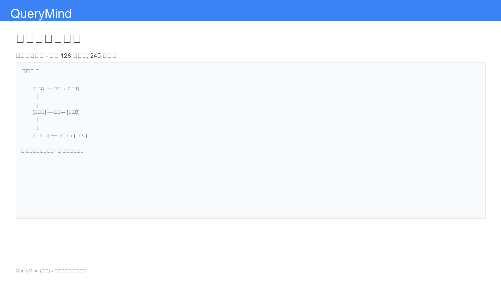
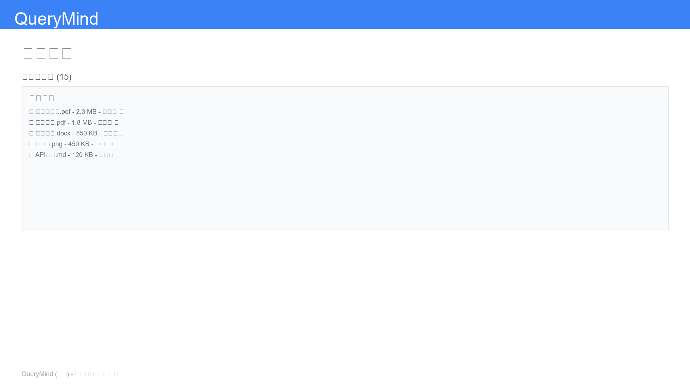
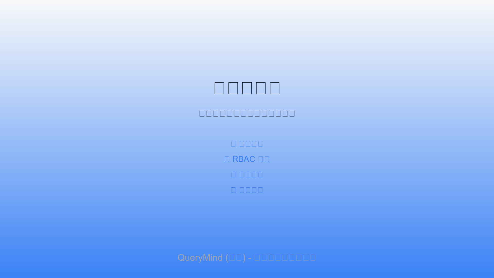

<div align="center">

# QueryMind（智询）

### 企业级智能问答引擎

[](./LICENSE)
[](https://www.python.org/downloads/)
[](https://fastapi.tiangolo.com/)
[](https://react.dev/)
[](./docs/history/VERSION_HISTORY.md)

**多智能体协作 · 混合检索 · 知识图谱增强 · 本地部署**

[功能特性](#-核心特性) · [快速开始](#-快速开始) · [架构说明](#-系统架构) · [文档](#-文档) · [更新日志](./CHANGELOG.md) · [中文文档](./docs/zh-CN/README.md)

</div>

---

## 📖 项目简介

**QueryMind（智询）** 是一个企业级智能问答引擎，专为私有知识库、内部知识助手和受控企业 AI 工作流设计。通过多智能体协作、混合检索策略和知识图谱增强，提供高质量的问答体验。

### 🎯 核心优势

- 🤖 **多智能体协作** - 基于 LangGraph 的智能路由和任务分配
- 🔍 **混合检索** - 向量检索 + BM25 + 重排序 + 知识图谱
- 🔐 **企业级安全** - RBAC 权限控制、数据隔离、审计日志
- 🌏 **多语言支持** - 中英文 NLP 优化、自动语言检测
- 📊 **实时监控** - 代理执行可视化、检索分析、性能指标
- 🚀 **本地优先** - 支持 Ollama、OpenAI、Anthropic 等多种模型

### 🖼️ 界面预览

> **注意**: 项目截图将在未来版本中添加到 GitHub。以下为界面预览占位。

<table>
  <tr>
    <td width="50%">
      
      <p align="center"><b>🔐 登录界面</b><br/>用户认证与会话管理</p>
    </td>
    <td width="50%">
      
      <p align="center"><b>💬 智能问答</b><br/>多轮对话与实时响应</p>
    </td>
  </tr>
  <tr>
    <td width="50%">
      
      <p align="center"><b>🤖 代理执行追踪</b><br/>实时可视化智能体工作流</p>
    </td>
    <td width="50%">
      
      <p align="center"><b>🕸️ 知识图谱</b><br/>实体关系可视化探索</p>
    </td>
  </tr>
  <tr>
    <td width="50%">
      
      <p align="center"><b>📄 文档管理</b><br/>上传、处理与索引管理</p>
    </td>
    <td width="50%">
      
      <p align="center"><b>👨‍💼 管理控制台</b><br/>用户管理与系统配置</p>
    </td>
  </tr>
</table>

### 🎬 功能演示

> **计划中**: 功能演示视频和 GIF 动图将在后续版本发布

**主要功能展示**：
- ✅ **智能问答演示** - 多轮对话、上下文理解、引用溯源
- ✅ **文档上传处理** - 支持多格式、批量上传、实时进度
- ✅ **知识图谱交互** - 实体查询、关系探索、可视化导航
- ✅ **代理执行追踪** - 实时流式更新、执行路径可视化
- ✅ **混合检索演示** - 向量检索、BM25、重排序融合
- ✅ **多语言支持** - 中英文无缝切换、智能语言检测

**截图获取指南**: 参考 [截图指南](./docs/images/SCREENSHOT_GUIDE.md)

---

## ✨ 核心特性

### 🤖 智能体系统

| 智能体 | 功能 | 特点 |
|--------|------|------|
| **Router Agent** | 查询意图分析与路由 | 智能判断查询类型，选择最优执行策略 |
| **Vector RAG Agent** | 混合检索与重排序 | 向量检索 + BM25 + Reranking，多策略融合 |
| **Graph RAG Agent** | 知识图谱查询 | Neo4j 实体关系查询，多跳推理 |
| **Web Research Agent** | 网络搜索 | 本地知识不足时，自动触发网络搜索 |
| **Synthesis Agent** | 答案生成与安全检查 | 引用溯源、安全防护、答案合成 |
| **React Agent** | 推理与行动循环 | 支持复杂任务的分步推理 |

### 🔍 检索能力

- **向量检索**: ChromaDB 密集检索，支持多种嵌入模型
- **BM25 检索**: 词频倒排索引，精确关键词匹配
- **混合融合**: Reciprocal Rank Fusion (RRF) 结果融合
- **重排序**: 基于 Cross-Encoder 的相关性重排序
- **知识图谱**: Neo4j 实体关系查询和多跳推理
- **中文优化**: Jieba 分词、同义词扩展、查询预处理

### 🔐 权限与安全

- **RBAC 系统**: Viewer（只读）和 Analyst（完全访问）角色
- **数据隔离**: 用户级数据隔离，多租户支持
- **会话管理**: JWT 认证，会话隔离，自动过期
- **审计日志**: 管理员操作追踪，安全事件记录
- **权限集成**: 前后端统一的权限检查机制

### 📊 监控与分析

- **实时追踪**: 代理执行可视化，SSE 流式更新
- **检索分析**: 检索统计、性能指标、可视化仪表板
- **性能对比**: 基线系统对比，全面评估指标（Precision, Recall, F1, MRR, NDCG）
- **运行时控制**: 检索配置热更新、金丝雀路由、回滚机制

### 🌏 多语言与国际化

- **自动语言检测**: 查询和文档的智能语言识别
- **会话语言偏好**: 用户级语言设置持久化
- **中文 NLP**: Jieba 分词、中文评估指标、查询预处理
- **界面国际化**: 中英文 UI，i18next 支持

### 📄 文档处理

- **多格式支持**: PDF, 图片, 文本, Office 文档
- **OCR 识别**: Tesseract OCR，图片文字提取
- **流式处理**: 大文件流式加载，减少 70% 内存使用
- **批量提取**: 并行图表提取，提升处理效率
- **增强分块**: 智能分块策略，保持语义完整性

---

## 🏗️ 系统架构

### 整体架构

QueryMind 采用现代化的**微服务架构**和**多智能体协作**设计，实现高性能、可扩展的企业级问答系统。

```
┌──────────────────────────────────────────────────────────────────────┐
│                          🎨 前端层 (Presentation)                      │
│  ┌─────────────────────────────────────────────────────────────────┐ │
│  │  React 18 + TypeScript + Vite + TailwindCSS                     │ │
│  ├─────────────────────────────────────────────────────────────────┤ │
│  │  💬 聊天   📄 文档   🕸️ 图谱   🤖 追踪   👤 管理   📊 分析      │ │
│  └─────────────────────────────────────────────────────────────────┘ │
└────────────────────────────┬─────────────────────────────────────────┘
                             │ REST API / SSE / WebSocket
┌────────────────────────────▼─────────────────────────────────────────┐
│                         🔧 API 网关层 (API Gateway)                    │
│  ┌─────────────────────────────────────────────────────────────────┐ │
│  │  FastAPI + Uvicorn + JWT Auth + CORS + Rate Limiting            │ │
│  └─────────────────────────────────────────────────────────────────┘ │
└────────────────────────────┬─────────────────────────────────────────┘
                             │
┌────────────────────────────▼─────────────────────────────────────────┐
│                      🤖 多智能体编排层 (Agent Layer)                   │
│  ┌─────────────────────────────────────────────────────────────────┐ │
│  │                    LangGraph Workflow Engine                     │ │
│  ├─────────────────────────────────────────────────────────────────┤ │
│  │                         ┌─────────┐                             │ │
│  │                         │ Router  │ 路由分析                     │ │
│  │                         │  Agent  │ 意图识别                     │ │
│  │                         └────┬────┘                             │ │
│  │                              │                                   │ │
│  │        ┌─────────────────────┼─────────────────────┐            │ │
│  │        │                     │                     │            │ │
│  │   ┌────▼────┐           ┌───▼────┐           ┌───▼────┐       │ │
│  │   │ Vector  │           │ Graph  │           │  Web   │       │ │
│  │   │   RAG   │           │  RAG   │           │ Search │       │ │
│  │   │ Agent   │           │ Agent  │           │ Agent  │       │ │
│  │   │向量检索 │           │图谱查询│           │网络搜索│       │ │
│  │   └────┬────┘           └───┬────┘           └───┬────┘       │ │
│  │        │                    │                    │            │ │
│  │        └────────────────────┼────────────────────┘            │ │
│  │                             ▼                                  │ │
│  │                      ┌─────────────┐                           │ │
│  │                      │  Synthesis  │  答案合成                 │ │
│  │                      │    Agent    │  引用标注                 │ │
│  │                      └──────┬──────┘  安全检查                 │ │
│  │                             │                                  │ │
│  │                      ┌──────▼──────┐                           │ │
│  │                      │    React    │  推理行动                 │ │
│  │                      │    Agent    │  复杂任务                 │ │
│  │                      └─────────────┘  (可选)                  │ │
│  └─────────────────────────────────────────────────────────────────┘ │
└────────────────────────────┬─────────────────────────────────────────┘
                             │
┌────────────────────────────▼─────────────────────────────────────────┐
│                      🎯 业务服务层 (Service Layer)                     │
│  ┌─────────────┐  ┌─────────────┐  ┌─────────────┐  ┌────────────┐ │
│  │  📝 文档     │  │  🔍 检索     │  │  🧠 LLM      │  │  🔐 认证   │ │
│  │  处理服务    │  │  服务        │  │  服务        │  │  授权服务  │ │
│  └─────────────┘  └─────────────┘  └─────────────┘  └────────────┘ │
│  ┌─────────────┐  ┌─────────────┐  ┌─────────────┐  ┌────────────┐ │
│  │  📊 分析     │  │  💾 缓存     │  │  📝 日志     │  │  ⚡ 监控   │ │
│  │  服务        │  │  服务        │  │  服务        │  │  服务      │ │
│  └─────────────┘  └─────────────┘  └─────────────┘  └────────────┘ │
└────────────────────────────┬─────────────────────────────────────────┘
                             │
        ┌────────────────────┼────────────────────┐
        │                    │                    │
┌───────▼────────┐  ┌────────▼────────┐  ┌───────▼────────┐
│  💾 数据存储层  │  │  🗄️ 向量存储层   │  │  🕸️ 图数据库层  │
├────────────────┤  ├─────────────────┤  ├────────────────┤
│ PostgreSQL/    │  │   ChromaDB      │  │    Neo4j       │
│ SQLite         │  │                 │  │                │
│                │  │ • 文档向量      │  │ • 实体关系     │
│ • 用户信息     │  │ • 语义检索      │  │ • 多跳推理     │
│ • 文档元数据   │  │ • 相似度匹配    │  │ • 知识图谱     │
│ • 会话历史     │  │ • Embeddings    │  │ • Cypher 查询  │
│ • 审计日志     │  │                 │  │                │
└────────────────┘  └─────────────────┘  └────────────────┘
        │                    │                    │
        └────────────────────┼────────────────────┘
                             │
                    ┌────────▼────────┐
                    │  🔴 Redis       │
                    │  (可选)         │
                    │                 │
                    │ • 缓存          │
                    │ • 会话存储      │
                    │ • 速率限制      │
                    └─────────────────┘
```

### 核心技术栈

#### 后端技术
| 技术 | 版本 | 用途 |
|------|------|------|
| **Python** | 3.11+ | 主要开发语言 |
| **FastAPI** | 0.104+ | 高性能异步 Web 框架 |
| **LangGraph** | 0.0.26+ | 多智能体工作流编排 |
| **LangChain** | 0.1+ | LLM 应用开发框架 |
| **SQLAlchemy** | 2.0+ | ORM 数据库操作 |
| **Pydantic** | 2.0+ | 数据验证和序列化 |
| **Uvicorn** | 0.24+ | ASGI 服务器 |

#### 前端技术
| 技术 | 版本 | 用途 |
|------|------|------|
| **React** | 18+ | 用户界面框架 |
| **TypeScript** | 5+ | 类型安全的 JavaScript |
| **Vite** | 5+ | 快速构建工具 |
| **TailwindCSS** | 3+ | 原子化 CSS 框架 |
| **Zustand** | 4+ | 轻量级状态管理 |
| **Axios** | 1.6+ | HTTP 客户端 |

#### 数据存储
| 技术 | 用途 | 特点 |
|------|------|------|
| **SQLite / PostgreSQL** | 关系型数据 | 用户、文档元数据、会话历史 |
| **ChromaDB** | 向量存储 | 文档嵌入、语义检索 |
| **Neo4j** | 图数据库（可选） | 知识图谱、实体关系 |
| **Redis** | 缓存（可选） | 会话缓存、速率限制 |

#### AI/LLM 支持
| 模型提供商 | 支持模型 | 用途 |
|-----------|---------|------|
| **Ollama** | Llama 3, Qwen 2, Mistral | 本地部署，隐私保护 |
| **OpenAI** | GPT-4, GPT-3.5, Embeddings | 云端 API，高性能 |
| **Anthropic** | Claude 3 (Opus/Sonnet/Haiku) | 高质量推理 |

### 查询处理流程

```
用户查询 "什么是机器学习？"
    │
    ▼
┌─────────────────────┐
│  1️⃣ JWT 认证验证     │  → 验证用户身份和权限
└──────────┬──────────┘
           ▼
┌─────────────────────┐
│  2️⃣ Router Agent    │  → 分析查询意图
│     意图分析         │     • 知识型查询 → Vector RAG
│                     │     • 关系型查询 → Graph RAG
└──────────┬──────────┘     • 最新信息 → Web Search
           ▼
     ┌─────┴─────┐
     │           │
┌────▼────┐ ┌───▼─────┐
│ 3️⃣ Vector│ │ Graph   │  → 并行执行检索
│   RAG    │ │  RAG    │
│          │ │         │
│ • 向量检索│ │ • 实体识别│
│ • BM25   │ │ • 关系查询│
│ • 混合融合│ │ • 多跳推理│
│ • 重排序  │ │         │
└────┬────┘ └───┬─────┘
     └─────┬─────┘
           ▼
┌─────────────────────┐
│  4️⃣ Synthesis Agent │  → 答案生成
│     答案合成         │     • 上下文整合
│                     │     • LLM 生成
│                     │     • 引用标注
│                     │     • 安全检查
└──────────┬──────────┘
           ▼
┌─────────────────────┐
│  5️⃣ 返回结果        │  → 流式或完整响应
│                     │     • 答案内容
│  • 答案             │     • 引用来源
│  • 引用来源         │     • 相似度分数
│  • Agent 追踪       │     • 执行追踪
└─────────────────────┘
```

### 混合检索架构

```
                    用户查询
                       │
        ┌──────────────┼──────────────┐
        │              │              │
   ┌────▼────┐    ┌───▼────┐    ┌───▼────┐
   │ 向量检索 │    │  BM25  │    │ 图谱   │
   │(语义)   │    │(关键词)│    │(关系)  │
   │         │    │        │    │        │
   │ChromaDB │    │Inverted│    │ Neo4j  │
   │Embedding│    │ Index  │    │ Cypher │
   └────┬────┘    └───┬────┘    └───┬────┘
        │             │             │
        └─────────┬───┴─────────────┘
                  ▼
          ┌──────────────┐
          │  RRF 融合     │  → 倒数排名融合
          │ (权重: 0.7,  │     Vector: 70%
          │       0.3)   │     BM25:   30%
          └──────┬───────┘
                 ▼
          ┌──────────────┐
          │  重排序        │  → Cross-Encoder
          │ (Reranking)  │     相关性重打分
          └──────┬───────┘
                 ▼
          ┌──────────────┐
          │  Top-K 结果   │  → 返回最相关的
          │  (默认: 5)    │     文档片段
          └──────────────┘
```

### 多智能体协作模式

| Agent | 触发条件 | 执行逻辑 | 输出 |
|-------|---------|---------|------|
| **Router Agent** | 每次查询 | 意图分析，选择执行路径 | 路由决策 |
| **Vector RAG Agent** | 知识型查询 | 向量+BM25 混合检索 | 文档片段列表 |
| **Graph RAG Agent** | 关系型查询 | Neo4j 实体关系查询 | 知识图谱结果 |
| **Web Research Agent** | 本地知识不足 | 网络搜索（可配置） | 网络搜索结果 |
| **Synthesis Agent** | 生成阶段 | LLM 生成+安全检查 | 答案+引用来源 |
| **React Agent** | 复杂任务（可选） | 推理与行动循环 | 分步执行结果 |

### 部署架构

**开发环境**：
```
localhost:5173 (前端) + localhost:8000 (后端) + 本地数据库
```

**生产环境**：
```
Nginx → [Frontend Cluster] → API Gateway → [Backend Cluster] → [Database Cluster]
```

**Docker 部署**：
```bash
docker-compose up -d  # 一键启动所有服务
```

---

**📚 详细架构说明**: [系统架构文档](./docs/zh-CN/guides/architecture.md)

---

## 🚀 快速开始

### 前置要求

- Python 3.11+
- Node.js 18+
- Conda（推荐）或 venv

### 安装步骤

1. **克隆仓库**

```bash
git clone https://github.com/pocheang/querymind.git
cd querymind
```

2. **后端安装**

```bash
# 创建虚拟环境
conda create -n querymind python=3.11
conda activate querymind

# 安装依赖
pip install -e .

# 配置环境变量
cp .env.example .env
# 编辑 .env 文件，设置模型 API Key
```

3. **前端安装**

```bash
cd frontend
npm install
npm run build
```

4. **启动服务**

```bash
# 后端（开发模式）
uvicorn app.api.main:app --reload --host 0.0.0.0 --port 8000

# 前端（开发模式）
cd frontend
npm run dev
```

5. **访问应用**

打开浏览器访问: http://localhost:5173

默认管理员账号: `admin` / 密码在首次启动时生成

### Docker 部署（推荐）

```bash
# 构建镜像
docker-compose build

# 启动服务
docker-compose up -d

# 查看日志
docker-compose logs -f
```

---

## 📚 文档

### 用户文档
- [快速入门指南](./docs/guides/QUICKSTART.md)
- [用户手册](./docs/guides/USER_GUIDE.md)
- [配置说明](./docs/guides/CONFIGURATION.md)

### 开发文档
- [架构设计](./docs/architecture/ARCHITECTURE.md)
- [API 文档](./docs/api/API_REFERENCE.md)
- [开发指南](./docs/development/DEVELOPMENT_GUIDE.md)
- [贡献指南](./CONTRIBUTING.md)

### 版本信息
- [更新日志](./CHANGELOG.md)
- [版本历史](./docs/history/VERSION_HISTORY.md)
- [发布说明](./docs/releases/)

---

## 🔧 配置说明

### 环境变量

关键配置项（`.env` 文件）:

```bash
# 模型配置
OPENAI_API_KEY=sk-...
ANTHROPIC_API_KEY=sk-ant-...
DEFAULT_MODEL_PROVIDER=openai
DEFAULT_MODEL_NAME=gpt-4

# 数据库配置
CHROMA_PERSIST_DIR=./data/chroma
NEO4J_URI=bolt://localhost:7687

# Redis 配置（可选）
REDIS_URL=redis://localhost:6379

# 安全配置
SECRET_KEY=your-secret-key
JWT_EXPIRE_MINUTES=1440

# 服务配置
BACKEND_PORT=8000
FRONTEND_PORT=5173
```

### 模型支持

**本地模型（Ollama）**:
```bash
# 安装 Ollama
curl -fsSL https://ollama.ai/install.sh | sh

# 下载模型
ollama pull qwen2.5:7b
ollama pull nomic-embed-text

# 配置 .env
DEFAULT_MODEL_PROVIDER=ollama
DEFAULT_MODEL_NAME=qwen2.5:7b
```

**云端模型**:
- OpenAI: GPT-4, GPT-3.5-Turbo
- Anthropic: Claude 3 Opus, Sonnet, Haiku

---

## 📊 功能对比

| 功能 | QueryMind | 传统 RAG | ChatGPT |
|------|-----------|----------|---------|
| 多智能体协作 | ✅ | ❌ | ❌ |
| 混合检索 | ✅ | 部分 | ❌ |
| 知识图谱 | ✅ | ❌ | ❌ |
| 本地部署 | ✅ | ✅ | ❌ |
| 权限控制 | ✅ | 部分 | ❌ |
| 数据隔离 | ✅ | ❌ | ❌ |
| 中文优化 | ✅ | 部分 | ✅ |
| 实时监控 | ✅ | ❌ | ❌ |
| 可扩展性 | ✅ | 部分 | ❌ |

---

## 🤝 贡献

欢迎贡献！请阅读 [贡献指南](./CONTRIBUTING.md) 了解详情。

### 开发流程

1. Fork 本仓库
2. 创建功能分支 (`git checkout -b feature/AmazingFeature`)
3. 提交更改 (`git commit -m 'Add some AmazingFeature'`)
4. 推送到分支 (`git push origin feature/AmazingFeature`)
5. 开启 Pull Request

---

## 📄 许可证

本项目采用 MIT 许可证 - 详见 [LICENSE](./LICENSE) 文件

---

## 🙏 致谢

感谢以下开源项目:
- [LangChain](https://github.com/langchain-ai/langchain) - LLM 应用框架
- [LangGraph](https://github.com/langchain-ai/langgraph) - 工作流编排
- [ChromaDB](https://github.com/chroma-core/chroma) - 向量数据库
- [FastAPI](https://github.com/tiangolo/fastapi) - Web 框架
- [React](https://github.com/facebook/react) - 前端框架

---

## 📞 联系方式

- 项目主页: https://github.com/pocheang/querymind
- 问题反馈: https://github.com/pocheang/querymind/issues
- 讨论区: https://github.com/pocheang/querymind/discussions

---

<div align="center">

**⭐ 如果这个项目对你有帮助，请给一个星标支持！**

Made with ❤️ by QueryMind Team

</div>
