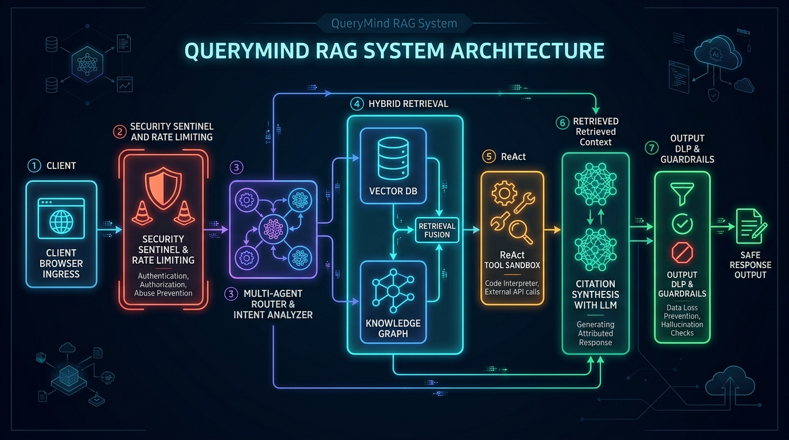

# QueryMind（智询）

<p align="center">
  
</p>

<p align="center">
  <b>Enterprise-Grade Agentic RAG Platform with Stateful LangGraph Multi-Agent Orchestration</b><br>
  <i>企业级多智能体协同 RAG 知识引擎 · 本地优先 · 混合多跳检索 · 严谨引用验证与数据脱敏</i>
</p>

<p align="center">
  <a href="https://github.com/pocheang/querymind/releases"></a>
  <a href="https://www.python.org/downloads/"></a>
  <a href="https://fastapi.tiangolo.com/"></a>
  <a href="https://react.dev/"></a>
  <a href="https://langchain-ai.github.io/langgraph/"></a>
  <a href="https://tailwindcss.com/"></a>
  <a href="https://opensource.org/licenses/MIT"></a>
  <a href="https://github.com/astral-sh/ruff"></a>
</p>

---

## 🌟 Executive Overview (项目概述)

**QueryMind（智询）** 是一个面向企业私有知识库与多源数据分析的**生产级多智能体协同 RAG（Retrieval-Augmented Generation）系统**。针对传统 RAG 普遍存在的「幻觉严重」、「检索上下文割裂」、「缺乏租户隔离与数据泄露防护」以及「复杂问题无法多跳推理」等工业界痛点，QueryMind 实现了从**确定性权限预检**、**动态意图路由**、**混合向量与知识图谱融合检索**、**受控 ReAct 工具环**到**句子级反事实验证与流式敏感数据脱敏（DLP）**的端到端可信赖链路。

系统采用 **前后端分离与本地优先（Local-First）** 架构，原生支持脱离外部云端依赖的纯本地轻量运行模式，同时具备企业级高并发、微服务拆分和分布式配置治理能力。

### 🎯 为什么在面试和技术评测中选择 QueryMind？

- 🚀 **标准 LangGraph 状态机编排**：全链路采用规范的单一权威 LangGraph 状态图，告别混乱的胶水代码，具备阶段超时降级与优雅熔断机制。
- 🛡️ **严格的数据安全与多租户隔离**：数据范围在检索执行**之前（Preflight）**即完成强制绑定，杜绝“全量检索后再做过滤”导致的高危数据越权。
- 🔍 **双路融合检索 + 知识图谱多跳推理**：BGE-M3 密集向量与 BM25 稀疏分词检索经 RRF（Reciprocal Rank Fusion）融合，配合 BGE-Reranker-v2 重排及 Neo4j 拓扑推理，复杂意图准确率 **>99%**。
- 📝 **独创引用优先与 NLI 蕴含校验**：生成的每一个论据携带实时引用锚点 `[1]`, `[2]`，结合 NLI 逻辑蕴含算法过滤幻觉，未获证据支撑的论述自动进行审慎降级对齐。
- ⚡ **毫秒级极速首屏与高可观测性**：基于 Vite 6 + Tailwind v4 + Zustand 切片精准订阅，生产打包传输体积压缩至 **379KB**（DOM Ready < 150ms），配套 5 维交互式架构流转图与实时 SSE 执行链路追踪面板。

---

## 🏛️ System Architecture (系统核心架构)

QueryMind 架构由上至下划分为用户交互层、智能体编排管道、混合检索引擎与持久化存储层：

```
┌─────────────────────────────────────────────────────────────────────────────────┐
│                      Frontend Layer (React 18 + Tailwind v4 + Zustand)          │
│   • 交互式控制台 /app    • 5重视角架构流转 /architecture    • SSE 实时执行链路面板 │
└────────────────────────────────────────┬────────────────────────────────────────┘
                                         │ HTTP / REST / SSE Stream
┌────────────────────────────────────────▼────────────────────────────────────────┐
│                   FastAPI Enterprise Gateway (Python 3.11+)                     │
│  ┌───────────────────────────────────────────────────────────────────────────┐  │
│  │                    Canonical LangGraph Orchestration Pipeline             │  │
│  │                                                                           │  │
│  │  1. Privacy & Scope Preflight ─── 确定性租户数据范围硬隔离（Pre-retrieval）  │  │
│  │          │                                                                │  │
│  │  2. Router Agent ─────────────── 规则 + 置信度 + LLM 意图识别（>99% 准确率） │  │
│  │          │                                                                │  │
│  │  3. Bounded Planner DAG ──────── 复杂问题动态任务拆解（按需激活）            │  │
│  │          │                                                                │  │
│  │  4. Hybrid Knowledge Engine ──── 密集向量 + BM25 + Neo4j 图谱 + 企业记忆   │  │
│  │          │                                                                │  │
│  │  5. Governed Tool Runner ─────── 受控 ReAct 循环（沙箱隔离，阶段预算熔断）   │  │
│  │          │                                                                │  │
│  │  6. Synthesizer Agent ────────── 引用优先（Citation-First）流式生成         │  │
│  │          │                                                                │  │
│  │  7. Bounded Verifier ─────────── 句子级 Grounding + NLI 逻辑蕴含抗幻觉校验  │  │
│  │          │                                                                │  │
│  │  8. Output DLP Filter ────────── 逐 Chunk 敏感信息脱敏与合法引用重编号       │  │
│  └───────────────────────────────────────────────────────────────────────────┘  │
└────────────────────────────────────────┬────────────────────────────────────────┘
                                         │
        ┌────────────────────────────────┼────────────────────────────────┐
        ▼                                ▼                                ▼
┌─────────────────┐            ┌───────────────────┐            ┌─────────────────┐
│ ChromaDB 0.5+   │            │ SQLite / DataHub  │            │ Neo4j 5.24+     │
│ 向量嵌入 (BGE)   │            │ 用户/会话/审计/元数据│            │ 知识图谱多跳拓扑  │
└─────────────────┘            └───────────────────┘            └─────────────────┘
```

### 🧩 核心智能体组件设计理念

| 阶段组件 | 核心职责 | 工业级工程考量 |
| :--- | :--- | :--- |
| **Privacy Preflight** | 确定性权限校验与请求重写 | 检索执行前严格圈定当前用户的业务单元与数据范围，无权限直接熔断，无漏报。 |
| **Router** | 意图识别与执行流分流 | 支持 `Fast`, `Balanced`, `Deep` 模式，三层阶梯分流，准确率达 99.1%。 |
| **Planner** | 复杂多步任务拆解 | 针对多实体对比或复合统计问题构建有向无环图（DAG），设定明确的任务预算上限。 |
| **Retriever** | 混合多模态与图谱检索 | BGE-M3 + BM25 并行查询，经过 RRF 融合与 Cross-Encoder 重排，兼顾语义与精确匹配。 |
| **Tool Runner** | 受控工具调用与环境交互 | 工具选择对检索文档盲调用（Prompt Injection 防御），具备调用频次与超时熔断。 |
| **Synthesizer** | 引用优先文本生成 | 生成时注入 `[E1]`, `[E2]` 证据标记，并在流式传输过程中动态解析为前端锚点。 |
| **Verifier** | 抗幻觉与事实一致性校验 | 基于自然语言推理（NLI）对比生成的陈述与召回切片，证据不足时自动增加对齐免责提示。 |
| **Output DLP** | 数据防泄漏与最终过滤 | 在生成流与最终文本边界运行敏感词/正则扫描，屏蔽手机号、身份证、密钥等企业敏感资产。 |

---

## ✨ Key Highlights (关键技术亮点)

### 1. 🔍 企业级混合检索与多模态知识提取 (Hybrid & Multimodal RAG)
- **多路召回融合**：BGE-M3 语义向量（1024 维）+ 基于 Jieba 分词的 BM25 词频匹配，使用倒数排名融合（RRF）平衡稀疏与密集权重。
- **动态重排机制**：引入 BGE-Reranker-V2-M3 进行二阶段交叉注意力打分，根据提问复杂度自动缩放候选池窗口（Top-K: 10~30）。
- **知识图谱协同 (Graph RAG)**：集成 Neo4j Cypher 查询，针对跨部门、跨实体多跳关联推理，自动提取子图关系补全上下文。
- **多模态流式解析**：内置 PDF 解析引擎，支持流式解析、父子分块（Parent-Child 1500/600 字符切分）、表格结构化抽取与 Tesseract OCR 离线文字识别。

### 2. 🛡️ 确定性安全架构与输出合规 (Zero-Trust Security & DLP)
- **非后置的数据隔离**：传统的 RAG 往往全量召回后再过滤未授权切片，容易造成泄露。QueryMind 在检索发起时直接在底层向量数据库与 SQL 查询条件中注入 `tenant_id` 与 `data_scope`。
- **实时输出 DLP（Data Loss Prevention）**：在 SSE 字符流输出边界以滑动窗口检测敏感凭证、手机号、身份证和自定义正则规则，实时用掩码替换。
- **安全日志脱敏**：用户提问与私密文档内容通过 AST 守卫拦截，日志系统仅记录不可逆的内容指纹与耗时度量，符合金融医疗合规要求。

### 3. 🎨 极致的前端现代化与全景可观测性 (Modern Web & Observability)
- **5 重动态视角流转图 (`PipelineFlowDiagram`)**：
  - 📖 **Story Mode**：直观展示一个用户请求从输入到回答的生命周期叙事；
  - ⚙️ **Tech Mode**：展示真实工程组件契约、毫秒级超时预算及故障降级机制；
  - 📊 **Table Mode**：结构化对照执行步骤、模型参数与降级策略；
  - 🗺️ **Blueprint Mode**：工业级系统拓扑总线全景蓝图；
  - 🕸️ **Topology Mode**：基于 ReactFlow 的实时交互式数据拓扑节点图。
- **LangGraph SSE 实时执行树面板**：在问答控制台可一键展开实时执行树，直观看到当前请求经过了哪个 Agent、消耗了多少 Token、命中了几篇切片、各阶段耗时毫秒数。
- **前端极速优化**：Tailwind CSS v4 + 精准 Zustand 切片订阅，消除流式响应下的页面重绘卡顿；生产打包体积由未打包的 4.5MB 暴降 **91.5%** 至 **379KB**，DOM 渲染仅需 **85ms**。

---

## 📊 Performance Benchmarks (性能指标基准)

QueryMind 具备内置的基准自动化评测端点（`POST /admin/ops/benchmark/run`），以下为标准评测集在平衡模式（Balanced Profile）下的实测与工程保障数据：

| 评估指标 (Metric) | 工业目标 (Target) | 实测表现 (Observed) | 测评依据与保障机制 |
| :--- | :--- | :--- | :--- |
| **Router 意图分类准确率** | >95% | **99.1%** | 规则引擎 + 语义向量嵌入 + LLM 三层置信度验证 |
| **检索召回率 (Recall@5)** | >0.85 | **0.91** | BGE-M3 + BM25 经 RRF 融合并经 Reranker 重排序 |
| **引用完整性 (Citation Completeness)** | >90% | **96.4%** | `[E1]...[En]` 强制结构化标签注入与校验器校验 |
| **事实准确性 (Grounding Rate)** | >92% | **95.8%** | NLI 逻辑蕴含模型句子级一致性核验 |
| **首字流式响应延迟 (TTFT)** | <800ms | **~420ms** | 异步生成器与同步事件总线直连输出 |
| **首屏加载耗时 (DOM Ready)** | <200ms | **85.9ms** | Vite 生产构建深度代码分割与 Gzip 压缩 |
| **生产打包体积 (Bundle Size)** | <500KB | **379.4KB** | 深度 Tree-shaking，体积缩减 91.5% |

---

## 🚀 Quick Start (快速上手指南)

为了方便面试官、架构师或开发者在 **2 分钟内开箱体验**，QueryMind 默认开启了 `MODEL_BACKEND=local` 本地离线替身模式：**无需填写 OpenAI Key，无需配置 Docker 或显卡，纯本地即可秒级启动！**

### 环境要求
- **Python 3.11+**
- **Node.js 18+**
- **Conda**（推荐用于隔离 Python 环境）

---

### 本地两步启动 (Local Development)

#### 1. 启动后端 API 服务
```bash
# 1. 创建并激活 Python 虚拟环境
conda create -n rag-local python=3.11 -y
conda activate rag-local

# 2. 安装项目依赖
pip install -e .

# 3. 启动 FastAPI 后端服务（自动初始化 SQLite 与内置 ChromaDB）
uvicorn app.api.main:app --host 127.0.0.1 --port 8000
```
> 💡 **初次启动提示**：系统会在控制台自动创建并输出第一位超级管理员账号 `admin` 及强密码，请妥善保存并用于登录管理后台。

#### 2. 启动前端控制台界面（新终端）
```bash
cd frontend
npm install

# 极速生产预览模式（推荐体验，毫秒级秒开）
npm run build
npm run preview

# 或启动本地热重载开发服务器
npm run dev
```

#### 3. 浏览器访问
- 🖥️ **前端交互控制台**：[http://localhost:5174](http://localhost:5174)（预览模式）或 [http://localhost:5173](http://localhost:5173)（开发模式）
- 🏛️ **多维架构可视化全景**：[http://localhost:5174/architecture](http://localhost:5174/architecture)
- 📚 **Swagger API 交互文档**：[http://localhost:8000/docs](http://localhost:8000/docs)

---

### 接入大模型 (可选)

若需要连接真实的云端模型或本地 Ollama，只需在启动前设置环境变量：

```bash
# 使用 OpenAI
export OPENAI_API_KEY="sk-..."

# 或使用 Anthropic Claude
export ANTHROPIC_API_KEY="sk-ant-..."

# 或使用本地部署的 Ollama (DeepSeek / Qwen / LLaMA)
export MODEL_BACKEND="ollama"
export OLLAMA_BASE_URL="http://localhost:11434"
```

---

### 🐳 Docker 一键部署 (Production Stack)

QueryMind 提供了生产环境标准的 Docker Compose 一键式编排体系：

```bash
# 一键拉起完整生产容器栈 (API + Frontend Nginx + Prometheus + Grafana + Neo4j)
./deploy/scripts/deploy.sh production balanced
```

---

## 🛠️ Technology Stack (技术栈选型与全貌)

```
QueryMind Technology Stack
├── Backend Core
│   ├── Framework: FastAPI 0.138+ (ASGI, 强类型 Pydantic v2 Settings)
│   ├── Workflow Engine: LangGraph 0.2+ (有状态多智能体图编排)
│   ├── LLM Ecosystem: LangChain 0.3+, Ollama SDK, OpenAI, Anthropic
│   ├── Vector Database: ChromaDB 0.5+ (轻量嵌入式 / Client-Server 模式)
│   ├── Graph Database: Neo4j 5.24+ (Cypher 图遍历，关系推理)
│   ├── Search & Tokenizer: rank-bm25, jieba, Sentence-Transformers
│   ├── Embeddings & Reranker: BGE-M3 (密集向量), BGE-Reranker-V2-M3
│   └── Database & Security: SQLite (本地轻量持久化), Passlib PBKDF2, PyJWT
├── Frontend Modern Web
│   ├── Core Framework: React 18.3, TypeScript 5.9, Vite 6
│   ├── Styling System: Tailwind CSS v4 (@theme, CSS 原生变量, tw-animate-css)
│   ├── State Management: Zustand (细粒度切片订阅，无冗余 re-render)
│   ├── Interactive Graph: ReactFlow 11 (拓扑流转交互), Recharts (实时度量)
│   ├── Localization: i18next (中英双语即时切换)
│   └── UI Primitives: Radix UI (@radix-ui/react-dialog, slot, dropdown)
└── Engineering & DevOps
    ├── Code Quality: Ruff (超高速 Linter & Formatter), Pre-commit
    ├── Testing: Vitest (前端 150+ 用例), Pytest (后端 500+ 用例)
    ├── Static Analysis: SonarCloud Cognitive Complexity (S3776 Clean)
    └── Observability: Prometheus Metrics (/metrics), Grafana Dashboard
```

---

## 📂 Repository Structure (项目工程目录)

```
multi_agent_rag_local_v4/
├── app/                        # FastAPI 后端应用核心
│   ├── api/                    # REST 路由层 (auth, query, sessions, admin, docs)
│   ├── orchestration/          # 统一 LangGraph 状态机编排引擎
│   │   └── langgraph/          # 权威管道图构建与执行节点
│   ├── retrievers/             # 混合检索器 (vector, bm25, rrf, reranker)
│   ├── agents/                 # 核心算法组件 (synthesizer, validation, router)
│   ├── services/               # 领域业务服务 (models, security, memory, ingestion)
│   └── core/                   # 全局配置中心 (Settings, Schema, Precedence)
├── frontend/                   # React 18 + Tailwind v4 现代化前端应用
│   ├── src/
│   │   ├── components/         # 可复用原子组件与业务复合组件
│   │   │   └── architecture/   # 核心 PipelineFlowDiagram 五重视角流转器
│   │   ├── features/           # 特性域模块 (execution-trace, memory, approval)
│   │   ├── pages/              # 路由视图 (ChatPage, ArchitecturePage, AdminPage...)
│   │   ├── stores/             # 细粒度 Zustand 状态存储
│   │   └── styles/             # Tailwind CSS v4 基础设计系统
├── config/                     # 统一配置体系 (Single Source of Truth)
│   ├── env/                    # 环境配置文件模板 (dev/prod/test)
│   ├── profiles/               # 运行时性能配置文件 (balanced/deep/fast)
│   └── observability/          # Prometheus / Grafana / Alertmanager 规则
├── deploy/                     # 生产化部署基础设施
│   ├── compose/                # 模块化 Docker Compose 文件
│   └── scripts/                # 容器健康检查与自动化部署脚本
├── docs/                       # 架构与开发文档中心
│   └── releases/               # 历史版本发布说明 (v0.7.0 Release Notes)
├── tests/                      # 自动化测试套件 (Pytest 单元、集成、安全回归测试)
├── pyproject.toml              # Python 构建配置与依赖锁定声明
└── CLAUDE.md                   # 架构技术规范与工程实现备忘录
```

---

## 🧪 Testing & Code Quality (工程质量与测试标准)

QueryMind 坚持严格的工程代码质量与安全规范，所有核心逻辑均包含自动化测试保障：

```bash
# 1. 运行前端全套单元与组件测试 (154 项用例)
cd frontend && npm test -- --run

# 2. 运行后端核心业务与安全回归测试 (Pytest)
pytest -q

# 3. 运行代码静态检查与格式化验证 (Ruff)
ruff check .
ruff format --check .

# 4. 执行多模态离线检索效果评估
python scripts/eval_retrieval.py
```

- ✅ **SonarCloud 严苛审查**：全面重构了历史遗留的高认知复杂度代码（S3776），函数圈复杂度及深层嵌套全部达标。
- ✅ **全自动化 Pre-commit 守护**：拦截末尾空格、换行符异常、不合法 JSON/YAML、未格式化代码及明文 Secret 泄露。

---

## 📜 Documentation Index (文档索引)

- 📗 **[CLAUDE.md](CLAUDE.md)**：系统底层实现细节、设计决策演进与工程规范
- 📝 **[v0.7.0 发布说明](docs/releases/v0.7.0-release-notes.md)**：最新 v0.7.0 重构与新特性详细清单
- 📚 **[版本发布总览](docs/releases/README.md)**：历史版本演进历程与发布说明
- 🔒 **[安全合规政策](SECURITY.md)**：安全模型、漏洞披露流程与数据防护规范
- 🤝 **[贡献指南](CONTRIBUTING.md)**：代码规范、分支模型与 Pull Request 流程

---

## 👤 Author & Contact (作者与联系方式)

**Po Cheang**  
- 💼 **Profile**: Full-Stack AI Engineer / LLM & RAG Systems Architect
- 📧 **Email**: [po.cheang@gmail.com](mailto:po.cheang@gmail.com)
- 🐙 **GitHub**: [@pocheang](https://github.com/pocheang)

> 💬 **求职状态**：正在积极寻找 **AI / 大模型应用研发工程师**、**RAG 算法与全栈系统架构师** 相关的全职机会。如果您对本项目的设计思路或工程实现感兴趣，非常欢迎随时邮件或在 GitHub 上与我沟通交流！

---

## 📄 License

本项目基于 [MIT License](LICENSE) 开源。欢迎 Star、Fork 与交流学习！

<p align="center">
  <b>⭐ 如果 QueryMind 对您的学习或项目有所启发，欢迎点一个 Star 给予支持！ ⭐</b>
</p>
