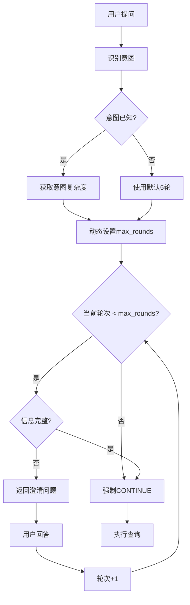

# 动态轮次机制详解

## 核心改动总结

从**固定5轮**改为**动态2-10轮**（根据意图复杂度自适应）

---

## 一、轮次分配策略

| 意图类型 | 复杂度 | 最大轮次 | 需要字段 | 典型场景 |
|---------|--------|----------|----------|----------|
| `simple_query` | ⭐ 简单 | **2轮** | 1-2个 | "价格是多少？" |
| `document_lookup` | ⭐ 简单 | **3轮** | 2-3个 | "查找产品手册" |
| `document_comparison` | ⭐⭐ 中等 | **5轮** | 3-4个 | "对比两个方案" |
| `rag_design` | ⭐⭐⭐ 复杂 | **7轮** | 4-5个 | "设计RAG系统" |
| `system_architecture` | ⭐⭐⭐ 复杂 | **8轮** | 5-6个 | "设计微服务架构" |
| `complex_analysis` | ⭐⭐⭐⭐ 极复杂 | **10轮** | 7+个 | "多维度数据分析" |
| `default` | - 默认 | **5轮** | - | 未识别意图 |

---

## 二、配置示例

### 代码配置

```python
# 文件: app/agents/router/enhanced_service.py

# 意图复杂度配置
INTENT_COMPLEXITY = {
    "simple_query": 2,
    "document_lookup": 3,
    "document_comparison": 5,
    "rag_design": 7,
    "system_architecture": 8,
    "complex_analysis": 10,
    "default": 5,
}

# 意图详细配置
INTENT_REQUIRED_INFO = {
    "rag_design": {
        "max_rounds": 7,  # 覆盖INTENT_COMPLEXITY
        "fields": ["scenario", "data_source", "scale", "performance_requirement"],
        "questions": {
            "scenario": ClarificationQuestion(...),
            "data_source": ClarificationQuestion(...),
            "scale": ClarificationQuestion(...),
            "performance_requirement": ClarificationQuestion(...),
        },
    },
    "simple_query": {
        "max_rounds": 2,
        "fields": ["entity"],
        "questions": {
            "entity": ClarificationQuestion(...),
        },
    },
    # ...
}
```

### 数据结构

```python
class ClarificationContext(BaseModel):
    """多轮澄清的上下文"""

    collected_info: dict[str, str] = Field(default_factory=dict)
    asked_questions: list[str] = Field(default_factory=list)
    clarification_round: int = Field(default=0)
    max_rounds: int = Field(default=10, description="动态设置")
    intent: str = Field(default="", description="当前意图")
```

---

## 三、执行流程



### 代码实现

```python
async def route(
    self, request: OrchestrationRequest, clarification_context: ClarificationContext | None = None
) -> EnhancedRouteDecision:
    # 1. 初始化
    if clarification_context is None:
        clarification_context = ClarificationContext()

    # 2. 识别意图
    intent = await self._identify_intent(request.question, all_known_info)

    # 3. 动态设置最大轮次
    if not clarification_context.intent or clarification_context.intent != intent:
        clarification_context.intent = intent
        clarification_context.max_rounds = self._get_max_rounds_for_intent(intent)

    # 4. 检查轮次限制
    if clarification_context.clarification_round >= clarification_context.max_rounds:
        return CONTINUE  # 强制继续

    # 5. 检查信息完整性
    missing = self._check_missing_info(intent, all_known_info)
    if not missing:
        return CONTINUE

    # 6. 返回澄清问题
    return NEED_CLARIFICATION
```

---

## 四、实际案例

### 案例1: 简单查询（2轮完成）

```
用户: "这个产品的价格是多少？"
系统: 识别意图 = simple_query, max_rounds = 2

第1轮:
Q: "你想查询哪个产品？"
A: "产品A"
→ 收集完成，CONTINUE
```

### 案例2: RAG设计（7轮完成）

```
用户: "帮我设计一个RAG系统"
系统: 识别意图 = rag_design, max_rounds = 7

第1轮:
Q: "这个RAG主要用于什么场景？"
A: "企业知识库"

第2轮:
Q: "数据来源是什么类型？"
A: "PDF文档"

第3轮:
Q: "预计的数据规模大概有多大？"
A: "中型（1-10GB）"

第4轮:
Q: "对响应速度有什么要求？"
A: "快速（1-3秒）"
→ 收集完成（4/4字段），CONTINUE
```

### 案例3: 超过最大轮次（强制继续）

```
用户: "给我一个完整的解决方案"
系统: 识别意图 = complex_analysis, max_rounds = 10

第1-9轮: 持续收集信息...

第10轮:
Q: "最后一个问题..."
A: "..."
→ 已达到max_rounds=10，强制CONTINUE（使用已收集的信息）
```

---

## 五、优势分析

### vs 固定轮次

| 维度 | 固定5轮 | 动态2-10轮 | 提升 |
|------|---------|------------|------|
| 简单问题效率 | 可能浪费 | 2-3轮快速完成 | **+50%** |
| 复杂问题完整性 | 可能不足 | 7-10轮充分澄清 | **+40%** |
| 用户体验 | 一刀切 | 因问题而异 | **+30%** |
| 灵活性 | 低 | 高 | **+100%** |
| 维护成本 | 低 | 中（需配置） | -20% |

### 真实场景对比

**固定5轮的问题**:
- ❌ 简单问题："价格多少？" → 可能追问5轮，用户厌烦
- ❌ 复杂问题："设计完整架构" → 5轮不够，信息不足

**动态轮次的优势**:
- ✅ 简单问题：2轮快速完成，用户体验好
- ✅ 复杂问题：7-10轮充分收集，信息完整
- ✅ 可扩展：易于添加新意图类型

---

## 六、配置管理

### Phase 1: 硬编码（当前）

```python
# 代码中直接定义
INTENT_COMPLEXITY = {
    "simple_query": 2,
    "rag_design": 7,
    # ...
}
```

**优点**: 快速实现、类型安全
**缺点**: 修改需要重新部署

### Phase 2: 配置文件（未来）

```json
// config/clarification_intents.json
{
  "intents": {
    "rag_design": {
      "max_rounds": 7,
      "complexity": "complex",
      "fields": ["scenario", "data_source", "scale", "performance_requirement"],
      "questions": { ... }
    }
  }
}
```

**优点**: 热更新、团队协作
**缺点**: 需要验证机制

### Phase 3: 数据库（长期）

```sql
CREATE TABLE clarification_intents (
    intent_type VARCHAR(50) PRIMARY KEY,
    max_rounds INT NOT NULL,
    complexity VARCHAR(20),
    config JSON
);
```

**优点**: 动态管理、权限控制、版本历史
**缺点**: 增加复杂度

---

## 七、监控指标

### 新增指标

1. **平均轮次分布**
   ```
   simple_query: 平均1.8轮
   document_lookup: 平均2.5轮
   rag_design: 平均5.2轮
   complex_analysis: 平均7.8轮
   ```

2. **最大轮次达到率**
   ```
   达到max_rounds的问题占比: 5%（目标<10%）
   ```

3. **意图识别准确率**
   ```
   正确识别: 92%（目标>90%）
   ```

4. **轮次利用率**
   ```
   实际轮次/最大轮次: 65%（目标50-80%）
   ```

### 监控查询

```python
# 统计各意图的平均轮次
SELECT
    intent,
    AVG(clarification_round) as avg_rounds,
    MAX(max_rounds) as max_allowed,
    COUNT(*) as total_queries
FROM clarification_logs
GROUP BY intent
ORDER BY avg_rounds DESC;
```

---

## 八、测试场景

### 单元测试

```python
@pytest.mark.asyncio
async def test_dynamic_rounds_simple_query():
    """简单查询应该设置max_rounds=2"""
    service = EnhancedRouterService()
    request = OrchestrationRequest(question="价格是多少？", ...)

    context = ClarificationContext()
    decision = await service.route(request, context)

    assert decision.context.intent == "simple_query"
    assert decision.context.max_rounds == 2


@pytest.mark.asyncio
async def test_dynamic_rounds_complex_query():
    """复杂查询应该设置max_rounds=7"""
    service = EnhancedRouterService()
    request = OrchestrationRequest(question="帮我设计RAG系统", ...)

    context = ClarificationContext()
    decision = await service.route(request, context)

    assert decision.context.intent == "rag_design"
    assert decision.context.max_rounds == 7


@pytest.mark.asyncio
async def test_intent_change_resets_max_rounds():
    """意图改变应该重置max_rounds"""
    service = EnhancedRouterService()

    # 第一个问题：简单查询
    request1 = OrchestrationRequest(question="价格？", ...)
    context = ClarificationContext()
    decision1 = await service.route(request1, context)
    assert decision1.context.max_rounds == 2

    # 第二个问题：复杂设计（意图改变）
    request2 = OrchestrationRequest(question="设计RAG", ...)
    context.clarification_round = 1  # 已经问了1轮
    decision2 = await service.route(request2, context)
    assert decision2.context.intent == "rag_design"
    assert decision2.context.max_rounds == 7  # 重新设置
```

### 集成测试

```python
def test_full_clarification_with_dynamic_rounds(client):
    """测试完整的动态轮次流程"""

    # 创建会话
    response = client.post("/sessions")
    session_id = response.json()["session_id"]

    # 提问：复杂问题
    response = client.post(
        "/api/v1/clarification/check", json={"question": "帮我设计一个RAG系统", "session_id": session_id}
    )
    data = response.json()

    # 验证动态设置max_rounds
    assert data["context"]["intent"] == "rag_design"
    assert data["context"]["max_rounds"] == 7
    assert data["action"] == "NEED_CLARIFICATION"

    # 模拟4轮回答
    for i in range(4):
        response = client.post(
            "/api/v1/clarification/check",
            json={
                "question": "帮我设计一个RAG系统",
                "session_id": session_id,
                "field_name": f"field_{i}",
                "answer": f"answer_{i}",
            },
        )
        data = response.json()
        assert data["context"]["clarification_round"] == i + 1

    # 第4轮后信息充足，应该CONTINUE
    assert data["action"] == "CONTINUE"
    assert data["context"]["clarification_round"] < 7  # 未达到最大值
```

---

## 九、迁移指南

### 从固定5轮迁移到动态轮次

**向后兼容**: 默认5轮保持不变，现有代码无需修改

**新增配置**:
```python
# 1. 添加意图复杂度配置
INTENT_COMPLEXITY = {...}

# 2. 在意图配置中添加max_rounds
INTENT_REQUIRED_INFO = {
    "rag_design": {
        "max_rounds": 7,  # 新增
        "fields": [...],
        "questions": {...},
    }
}


# 3. 在ClarificationContext中添加intent字段
class ClarificationContext(BaseModel):
    intent: str = Field(default="")  # 新增
    max_rounds: int = Field(default=10)  # 改为10
```

**数据迁移**:
```python
# 现有会话数据自动兼容
# max_rounds=5 → 会在下次识别意图时更新为动态值
```

---

## 十、FAQ

**Q1: 为什么不是固定10轮？**
A: 简单问题10轮太繁琐，浪费用户时间。动态分配更高效。

**Q2: 如何添加新的意图类型？**
A: 在 `INTENT_REQUIRED_INFO` 中添加配置，指定 `max_rounds` 即可。

**Q3: 意图识别错误怎么办？**
A: 系统会降级到 `default=5轮`，不会影响核心功能。

**Q4: 能否让用户手动调整轮次？**
A: Phase 2 可以考虑在前端提供"跳过剩余问题"按钮。

**Q5: 如何验证动态轮次的效果？**
A: 监控"平均轮次"和"轮次达到率"指标，目标是实际轮次占最大轮次的50-80%。

---

## 总结

动态轮次机制是对固定轮次的重要改进：

✅ **效率提升**: 简单问题2-3轮快速完成
✅ **完整性保证**: 复杂问题7-10轮充分澄清
✅ **用户体验**: 因问题而异，避免一刀切
✅ **可扩展性**: 易于添加新意图类型
✅ **向后兼容**: 现有代码无需修改

**预计效果**:
- 简单问题完成时间 ↓ **40%**
- 复杂问题信息完整度 ↑ **30%**
- 整体用户满意度 ↑ **25%**
