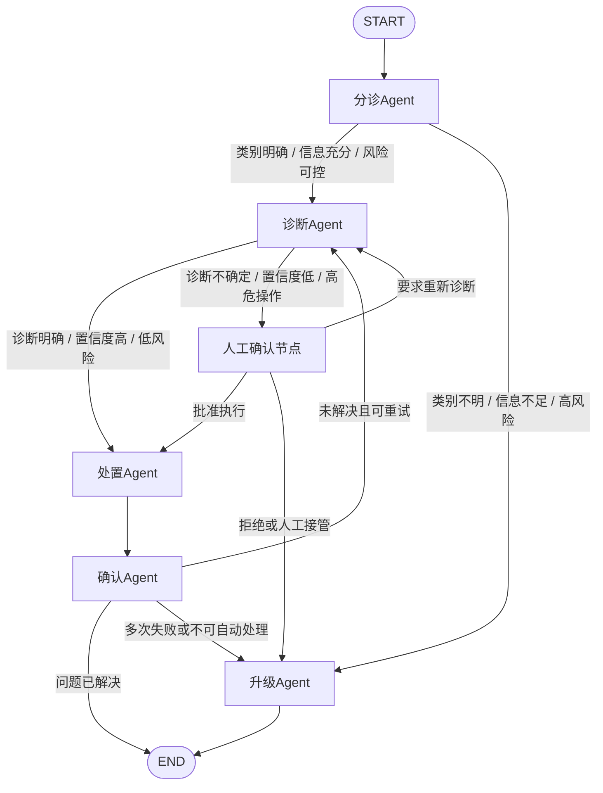

# 智能 IT 运维助手 LangGraph 多智能体协作架构设计

## 1. 背景说明

某企业 IT 运维部门每天需要处理 200+ 工单，工单类型覆盖密码重置、网络故障、权限申请、服务器异常等常见场景。传统人工处理方式存在响应速度慢、重复劳动多、处理标准不一致、故障经验难沉淀等问题。

为提升工单处理效率和自动化水平，本方案基于 LangGraph 的 `StateGraph` 设计一个多智能体协作系统。系统将完整工单处理流程拆分为分诊、诊断、处置、确认、升级五个阶段，每个阶段由独立 Agent 负责，并通过共享 State 和条件路由实现协作。

本系统不是简单的单轮问答机器人，而是一个面向 IT 运维流程的自动化协作系统。它既要能处理低风险、高频、标准化工单，也要能在高风险、不确定、自动处理失败的场景中及时暂停并引入人工。

## 2. 设计目标

系统设计目标如下：

| 目标 | 说明 |
|---|---|
| 自动分诊 | 自动识别工单类别、紧急程度、影响范围和处理风险 |
| 自动诊断 | 根据不同工单类型调用对应运维工具进行故障定位 |
| 自动处置 | 对低风险、标准化问题执行自动修复动作 |
| 结果确认 | 自动验证处置结果，判断问题是否真正解决 |
| 人工兜底 | 对高风险、低置信度、自动处理失败的工单升级人工 |
| 全程可追踪 | 保存分诊、诊断、处置、确认、升级过程中的完整审计记录 |
| 风险可控 | 通过人工确认、重试、降级、熔断等机制控制生产风险 |

## 3. 多 Agent 职责划分

系统由五类核心 Agent 组成。

| Agent | 核心职责 | 典型输入 | 典型输出 |
|---|---|---|---|
| 分诊Agent | 接收工单，识别类别、紧急程度、影响范围和是否可自动处理 | 工单标题、描述、用户信息 | 工单类别、优先级、风险等级、路由决策 |
| 诊断Agent | 根据工单类别调用对应工具进行故障诊断 | 分诊结果、工单上下文、历史记录 | 故障原因、诊断证据、置信度、建议处置方案 |
| 处置Agent | 执行修复操作，如重启服务、重置密码、开通权限 | 诊断结果、处置计划、审批结果 | 执行结果、错误信息、变更记录 |
| 确认Agent | 验证处置结果，判断工单是否解决 | 处置结果、验证规则、监控数据 | 是否解决、验证证据、下一步建议 |
| 升级Agent | 未解决或高风险时升级人工，并附带上下文摘要 | 全量 State、失败原因、审计日志 | 升级摘要、人工处理建议、最终状态 |

这种职责划分可以避免单个 Agent 同时承担理解、诊断、执行和验证等复杂职责，使系统更容易维护、扩展和审计。

## 4. StateGraph 总体架构

整体流程采用 LangGraph 的 `StateGraph` 进行编排。每个 Agent 是图中的一个节点，节点之间通过条件边进行流转。

## 5. 核心状态流转说明

### 5.1 正常自动闭环流程

对于低风险、高频、规则明确的工单，系统可以完成自动闭环：

1. 工单进入系统。
2. 分诊 Agent 判断工单类别和优先级。
3. 诊断 Agent 调用工具定位原因。
4. 处置 Agent 执行修复动作。
5. 确认 Agent 验证结果。
6. 如果验证成功，工单结束。

示例场景：

- 普通密码重置
- 单用户账号锁定
- 普通 VPN 连接失败
- 测试环境非核心服务异常

### 5.2 人工确认流程

当系统判断存在风险或不确定性时，需要暂停自动流程，等待人工确认。

典型场景：

- 涉及生产服务重启
- 涉及核心权限变更
- 诊断结果置信度低
- 工单影响多个部门或核心系统
- 处置动作可能造成业务中断

人工确认后，系统可以继续执行、重新诊断或升级人工。

### 5.3 失败升级流程

当自动化无法解决问题时，系统进入升级 Agent。

触发条件包括：

- 工单类型无法识别
- 工单描述信息不足
- 诊断工具不可用
- 自动处置失败
- 多次重试后仍未恢复
- 确认 Agent 验证失败

升级 Agent 会将前面所有 Agent 的处理过程整理成摘要，方便人工运维快速接手。

## 6. State 数据结构设计

State 是整个多 Agent 流程中的共享上下文，用于保存工单信息、当前阶段、诊断结果、处置结果、验证结果和审计记录。

| 字段 | 类型说明 | 作用 |
|---|---|---|
| `ticket_id` | 字符串 | 工单唯一 ID |
| `user_id` | 字符串 | 提交工单的用户 ID |
| `user_department` | 字符串 | 用户所属部门，用于判断影响范围 |
| `title` | 字符串 | 工单标题 |
| `description` | 字符串 | 工单详细描述 |
| `category` | 枚举 | 工单类别，如 password_reset、network_issue、permission_request、server_incident |
| `priority` | 枚举 | 紧急程度，如 P0、P1、P2、P3 |
| `impact_scope` | 字符串 | 影响范围，如单用户、部门、核心系统 |
| `risk_level` | 枚举 | 风险等级，如 low、medium、high |
| `current_stage` | 枚举 | 当前阶段，如 triage、diagnosis、action、verification、escalation |
| `triage_result` | 对象 | 分诊结果，包括分类、优先级、风险判断和路由建议 |
| `diagnosis_result` | 对象 | 诊断结果，包括故障原因、工具返回、证据链和置信度 |
| `action_plan` | 对象 | 建议执行的处置方案 |
| `action_result` | 对象 | 处置执行结果，包括成功、失败、异常原因和变更记录 |
| `verification_result` | 对象 | 验证结果，包括是否恢复、验证依据和用户反馈 |
| `retry_count` | 数字 | 当前自动重试次数 |
| `max_retry` | 数字 | 最大允许重试次数 |
| `need_human_approval` | 布尔值 | 是否需要人工确认 |
| `human_feedback` | 字符串 | 人工审批、拒绝或补充意见 |
| `escalation_summary` | 字符串 | 升级人工时的结构化摘要 |
| `audit_logs` | 列表 | 全流程审计日志 |
| `final_status` | 枚举 | 最终状态，如 resolved、escalated、failed |

其中，`current_stage` 决定当前工单处于哪个处理阶段；`diagnosis_result` 和 `action_result` 决定是否可以进入下一步；`retry_count` 和 `max_retry` 用于控制失败后的自动重试次数；`need_human_approval` 用于触发人工确认节点。

## 7. 节点设计

### 7.1 分诊Agent

分诊 Agent 是系统入口，负责理解工单并决定后续路径。

主要职责：

- 提取工单关键信息
- 识别工单类别
- 判断紧急程度
- 判断影响范围
- 判断风险等级
- 判断是否可自动处理
- 决定进入诊断、人工确认或升级

分诊输出示例：

| 输出项 | 示例 |
|---|---|
| 工单类别 | password_reset、network_issue、permission_request、server_incident |
| 优先级 | P0、P1、P2、P3 |
| 风险等级 | low、medium、high |
| 是否可自动处理 | true / false |
| 是否需要人工确认 | true / false |
| 下一节点 | diagnosis / human_approval / escalation |

### 7.2 诊断Agent

诊断 Agent 根据工单类别调用不同工具进行问题定位。

| 工单类别 | 诊断工具 | 诊断目标 |
|---|---|---|
| 密码重置 | 账号系统、身份认证系统、MFA 状态检查 | 判断账号是否锁定、密码是否过期、MFA 是否异常 |
| 网络故障 | Ping、DNS 检测、VPN 状态、网关连通性检测 | 判断是本地网络、VPN、DNS 还是网关问题 |
| 权限申请 | IAM 系统、权限模板、审批规则 | 判断权限是否已有、是否符合申请规则 |
| 服务器异常 | 监控系统、日志系统、进程状态、CPU/内存/磁盘指标 | 判断是否资源不足、服务异常或进程崩溃 |

诊断 Agent 输出内容：

- 故障原因
- 诊断证据
- 工具调用结果
- 诊断置信度
- 建议处置方案
- 是否需要人工确认

### 7.3 处置Agent

处置 Agent 负责执行修复动作。它不直接决定是否高风险，而是依据 State 中的风险判断、审批状态和处置计划执行。

典型处置动作：

| 场景 | 处置动作 |
|---|---|
| 密码重置 | 重置密码、强制下次登录修改密码 |
| 账号锁定 | 解锁账号、清理异常登录状态 |
| 网络异常 | 刷新 VPN 会话、重置网络配置、提示用户更换网络 |
| 权限申请 | 根据审批结果授予权限 |
| 服务异常 | 重启非核心服务、清理临时文件、释放资源 |

对于以下高危动作，处置 Agent 执行前必须经过人工确认：

- 生产服务重启
- 防火墙规则修改
- 数据库权限变更
- 核心系统管理员权限授予
- 批量账号操作
- 可能造成业务中断的变更

### 7.4 确认Agent

确认 Agent 用于验证处置是否真正解决问题，避免只执行动作但没有闭环。

验证方式包括：

- 检查服务健康状态
- 再次调用监控指标
- 验证账号是否可登录
- 验证权限是否生效
- 向用户发送确认请求
- 对比处置前后的异常指标

确认结果分为三类：

| 确认结果 | 后续流转 |
|---|---|
| 已解决 | 进入 END |
| 未解决但可重试 | 回到诊断 Agent 或处置 Agent |
| 未解决且不可自动处理 | 进入升级 Agent |

### 7.5 升级Agent

升级 Agent 是系统的人工兜底节点，负责将自动处理过程整理成可读摘要并转交人工。

升级摘要应包含：

- 工单基本信息
- 分诊结论
- 诊断步骤
- 工具调用结果
- 已执行的处置动作
- 失败原因
- 当前风险判断
- 建议人工处理方案

升级 Agent 的价值在于减少人工接手时的重复排查成本，让人工运维直接基于已有上下文继续处理。

## 8. 条件边与路由逻辑

### 8.1 分诊Agent到诊断Agent

分诊 Agent 到诊断 Agent 的路由应同时考虑类别、风险、信息完整度和自动化能力。

满足以下条件时进入诊断 Agent：

- 工单类别明确
- 工单描述信息充足
- 存在对应自动化诊断工具
- 操作风险低或中等
- 不涉及敏感系统或高危权限
- 当前工单未命中安全或合规限制

示例：

| 工单内容 | 分诊结果 | 路由 |
|---|---|---|
| “我忘记了邮箱密码” | 密码重置，低风险 | 诊断Agent |
| “VPN 连不上” | 网络故障，中低风险 | 诊断Agent |
| “申请普通系统只读权限” | 权限申请，中风险 | 诊断Agent，必要时人工确认 |
| “测试环境服务异常” | 服务器异常，中风险 | 诊断Agent |

### 8.2 分诊Agent到升级Agent

以下情况应直接升级或进入人工确认：

| 场景 | 路由 |
|---|---|
| 工单类别无法识别 | 升级Agent |
| 工单描述过于模糊 | 升级Agent或请求补充信息 |
| 影响范围为核心系统 | 人工确认或升级Agent |
| 涉及生产数据库权限 | 人工确认 |
| 涉及核心服务重启 | 人工确认 |
| 命中安全风险关键词 | 升级Agent |
| 分诊置信度低于阈值 | 升级Agent |

### 8.3 诊断Agent到处置Agent

满足以下条件时，诊断结果可以进入处置 Agent：

- 诊断原因明确
- 诊断置信度达到阈值
- 有明确处置方案
- 处置动作在自动化白名单内
- 风险等级可接受
- 不需要额外人工审批

否则，应进入人工确认节点或升级 Agent。

### 8.4 确认Agent后的路由

确认 Agent 根据验证结果决定最终流向：

| 条件 | 后续节点 |
|---|---|
| 验证成功 | END |
| 验证失败且未超过重试上限 | 回到诊断Agent |
| 验证失败且超过重试上限 | 升级Agent |
| 用户反馈仍未恢复 | 升级Agent |
| 发现新故障线索 | 回到诊断Agent |

## 9. 人工介入点设计

人工介入点用于控制风险，保证系统不会在不确定或高危场景中盲目执行自动化操作。

| 介入位置 | 触发条件 | 人工可执行动作 |
|---|---|---|
| 分诊后 | 类别不明、影响范围大、优先级高 | 修改分类、补充信息、人工接管 |
| 诊断后 | 诊断置信度低、多个可能原因 | 确认原因、要求重新诊断 |
| 处置前 | 涉及重启服务、权限变更、防火墙调整 | 批准、拒绝、修改处置方案 |
| 处置后 | 自动处置失败、工具返回异常 | 允许重试、修改方案、升级人工 |
| 确认后 | 用户反馈未恢复、多次验证失败 | 人工接管 |

人工确认节点暂停 StateGraph 执行，等待运维人员输入审批意见。人工确认后，系统根据反馈继续流转。

| 人工反馈 | 后续节点 |
|---|---|
| 批准执行 | 处置Agent |
| 拒绝执行 | 升级Agent |
| 修改处置方案 | 处置Agent |
| 要求重新诊断 | 诊断Agent |
| 人工接管 | 升级Agent |

## 10. 外部 API 超时率 15% 的重试与降级机制

诊断 Agent 依赖多个外部 API，例如监控系统、账号系统、CMDB、日志平台、IAM 系统等。如果某个外部 API 超时率达到 15%，系统不能简单失败，也不能无限重试，否则会影响整体工单处理效率，甚至造成雪崩。

### 10.1 重试机制

重试策略如下：

| 策略 | 说明 |
|---|---|
| 有限重试 | 最多重试 2 到 3 次，避免无限循环 |
| 指数退避 | 每次失败后等待时间递增，例如 1 秒、2 秒、4 秒 |
| 随机抖动 | 在退避时间上加入随机值，避免大量请求同时重试 |
| 错误分类 | 只对 timeout、502、503 等临时错误重试 |
| 快速失败 | 对权限错误、参数错误、业务规则错误不重试 |
| 审计记录 | 每次失败都写入 `audit_logs` |

### 10.2 降级机制

如果重试后仍失败，系统进入降级路径。

| 降级方式 | 说明 |
|---|---|
| 备用工具 | 主监控 API 失败时切换备用监控或日志平台 |
| 缓存数据 | 使用最近一次健康检查、指标快照或 CMDB 缓存 |
| 历史工单 | 使用相似历史工单辅助判断 |
| 降低置信度 | 标记为疑似问题，不直接执行高危操作 |
| 异步补偿 | 先给出初步诊断，后台继续补偿调用 |
| 人工升级 | 关键 API 不可用且风险较高时转人工 |

### 10.3 熔断机制

当某 API 连续失败达到阈值时，应开启熔断机制。

| 熔断状态 | 行为 |
|---|---|
| Closed | 正常调用 API |
| Open | 暂停调用 API，直接走降级路径 |
| Half-open | 少量探测请求，成功后恢复调用 |

熔断机制可以避免不稳定 API 拖慢整个工单系统，也可以防止对故障服务持续施压。

### 10.4 State 中增加容错字段

为支持重试、降级和熔断，State 中可增加以下字段：

| 字段 | 说明 |
|---|---|
| `api_retry_count` | API 当前重试次数 |
| `api_error_type` | API 错误类型，如 timeout、rate_limit、server_error |
| `fallback_used` | 是否使用了降级方案 |
| `fallback_source` | 降级数据来源，如缓存、备用 API、历史工单 |
| `confidence_score` | 当前诊断置信度 |
| `circuit_breaker_status` | API 熔断状态 |

如果使用降级数据后置信度较低，系统应进入人工确认节点，不应直接执行高风险处置。

## 11. 安全与审计设计

IT 运维场景中的自动化必须具备安全边界和审计能力。

| 机制 | 说明 |
|---|---|
| 权限校验 | 处置 Agent 执行动作前校验操作权限 |
| 操作白名单 | 只允许自动执行低风险、标准化操作 |
| 高危操作审批 | 生产变更、核心权限变更必须人工确认 |
| 审计日志 | 记录每个 Agent 的输入、输出、工具调用和路由决策 |
| 回滚机制 | 关键处置动作应具备回滚方案 |
| 敏感信息保护 | 对密码、Token、密钥等信息脱敏处理 |
| 最小权限原则 | 每个 Agent 只拥有完成自身职责所需的最小权限 |

审计日志建议至少记录：

- 工单 ID
- 当前 Agent
- 输入 State 摘要
- 工具调用参数
- 工具调用结果
- 路由决策
- 人工审批意见
- 处置动作和执行结果
- 最终状态

## 12. 示例流程

### 12.1 示例一：账号锁定自动处理

工单内容：

> 我无法登录 OA 系统，提示账号被锁定。

处理流程：

1. 用户提交工单。
2. 分诊 Agent 判断类别为账号问题，优先级 P2，风险低。
3. 系统进入诊断 Agent。
4. 诊断 Agent 调用账号系统检查账号状态。
5. 诊断结果显示账号因多次输错密码被锁定。
6. 处置 Agent 执行账号解锁，并要求用户重置密码。
7. 确认 Agent 检查账号状态恢复正常。
8. 工单状态更新为 resolved。

### 12.2 示例二：生产服务异常需要人工确认

工单内容：

> 生产订单服务响应很慢，怀疑服务异常。

处理流程：

1. 分诊 Agent 判断类别为服务器异常，影响核心业务，优先级 P1。
2. 诊断 Agent 调用监控系统和日志系统。
3. 诊断结果显示服务内存占用过高，建议重启服务。
4. 由于涉及生产核心服务重启，系统进入人工确认节点。
5. 人工运维确认当前可执行重启。
6. 处置 Agent 执行重启动作。
7. 确认 Agent 检查服务健康状态和接口响应时间。
8. 如果恢复正常，工单结束；如果仍异常，则升级人工。

### 12.3 示例三：诊断 API 超时后降级

工单内容：

> VPN 无法连接。

处理流程：

1. 分诊 Agent 判断类别为网络故障。
2. 诊断 Agent 调用 VPN 状态 API。
3. API 连续超时，系统按指数退避重试。
4. 重试失败后，系统使用最近一次 VPN 健康检查缓存。
5. 如果缓存显示 VPN 网关近期异常，则生成低置信度诊断。
6. 系统将该工单升级人工，并附带 API 超时信息和缓存诊断结果。

## 13. 方案优势

| 优势 | 说明 |
|---|---|
| 职责清晰 | 每个 Agent 只负责一个阶段，便于维护和扩展 |
| 流程可控 | 通过 StateGraph 明确节点、边和条件分支 |
| 风险可控 | 高危操作必须人工确认，避免自动化误操作 |
| 闭环验证 | 处置后必须经过确认 Agent 验证 |
| 可追溯 | 所有诊断、处置、路由和人工操作都有审计记录 |
| 可扩展 | 后续可新增知识库 Agent、审批 Agent、通知 Agent 等 |
| 高可用 | 对外部 API 异常提供重试、降级和熔断机制 |

## 14. 总结

本方案基于 LangGraph 的 `StateGraph` 构建智能 IT 运维多 Agent 协作系统，将复杂工单处理流程拆解为分诊、诊断、处置、确认、升级五个阶段。

分诊 Agent 负责判断工单类别和处理路径；诊断 Agent 负责调用工具定位问题；处置 Agent 负责执行低风险修复动作；确认 Agent 负责验证处理结果；升级 Agent 负责在自动流程无法闭环时转交人工。

通过共享 State、条件路由、人工确认、审计日志、重试降级和熔断机制，该系统既能提升常见 IT 工单的自动化处理效率，也能保证生产环境中的安全性、可控性和可追踪性。
